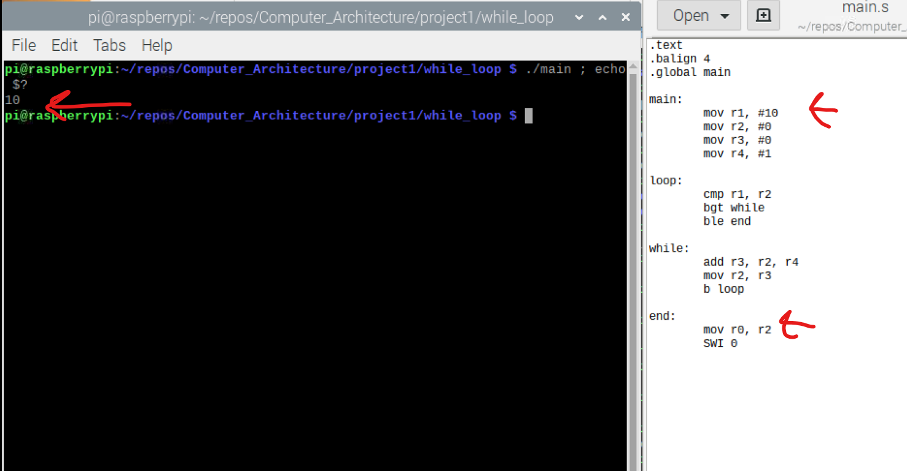
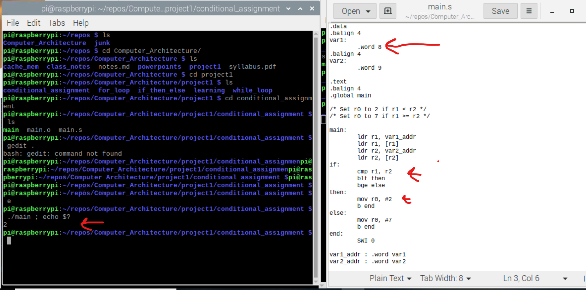
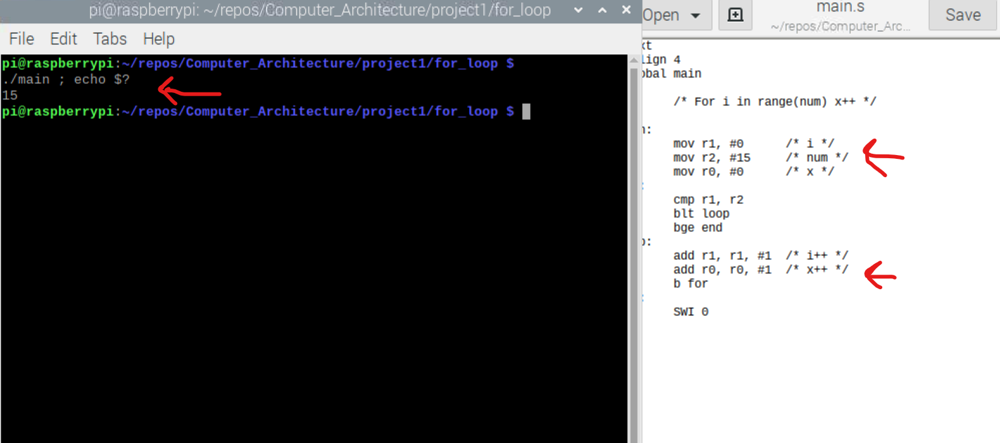
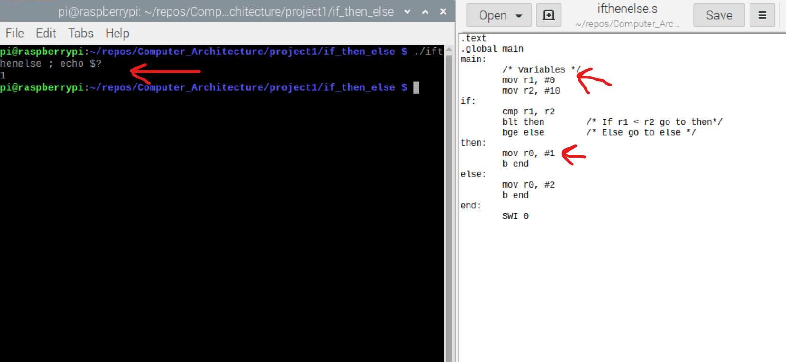

Robby Bergers

Project 1

[View the project on GitHub](https://github.com/RobbyB97/Computer_Architecture/tree/master/project1")

### While Loop

[Assembly file](./while_loop/wl.png)

For the while loop, the main branch loads the values into the registers. 10 in r1, 0 in r2 and r3, and 1 in r4. This is followed by the loop branch, which compares r1 to r2. While r1 is greater than r2, the while branch executes which adds 1 to r2. Once r1 is not greater than r2, the end branch executes, which moves the value of r2 into r0.

___
### Conditional Assignment

For the conditional assignment, the main branch loads the values into r1 and r2. If r1 is less than r2, the value 2 is loaded into r0. If not, the value 7 is loaded into r0.

___
### For Loop

For the for loop, the main branch loads 0 into r1 and r0 and 15 into r2. For each number in between 0 and 15, r1 and r0 are incremented in the for and loop branches.

___
### If Then ELse

For if then else, in the main branch the values are loaded into r1 and r2. In the if branch, r1 and r2 are compared. If r1 is less then r2, then the value 1 is loaded into r0. Else, the value 2 is loaded into r0.

___